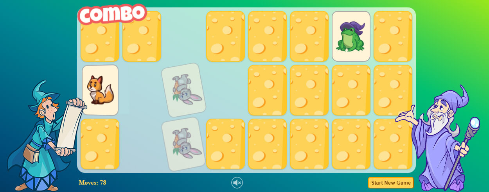
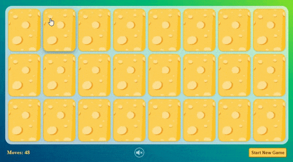

# Memory-Card-Game---Match-Pairs

### See it live [Match Pairs Game](https://danilo-89.github.io/projects/Memory-Card-Game---Match-Pairs/index.html)
-------------

### About
-------------
- Simple game of memory (other names: Concentration, Match Match, Match Up, Pelmanism, Shinkei-suijaku, Pexeso or Pairs);
- Completely in HTML, CSS and vanilla JavaScript;
- Responsive design;
- Tested and working on Chrome, Firefox, Edge, IE(9>), Opera and Brave.

### Preview
-------------

### Credits
-------------
Used CSS Animations:
- [Animista](https://animista.net/)
- [theappguruz](https://www.theappguruz.com/tag-tools/web/CSSAnimations/) 

Used graphics:
- [Pixabay/GraphicMama-team (most of images)](https://pixabay.com/users/graphicmama-team-2641041/)
- [Pixabay/rfind (back of the cards)](https://pixabay.com/vectors/cheese-cheezy-charcuterie-5202701/)
- [Pixabay/Fauna (css, html, js icons)](https://pixabay.com/illustrations/wordpress-joomla-drupal-bootstrap-3288420/)
